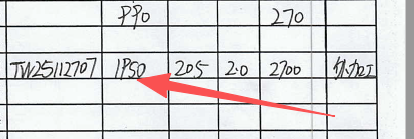
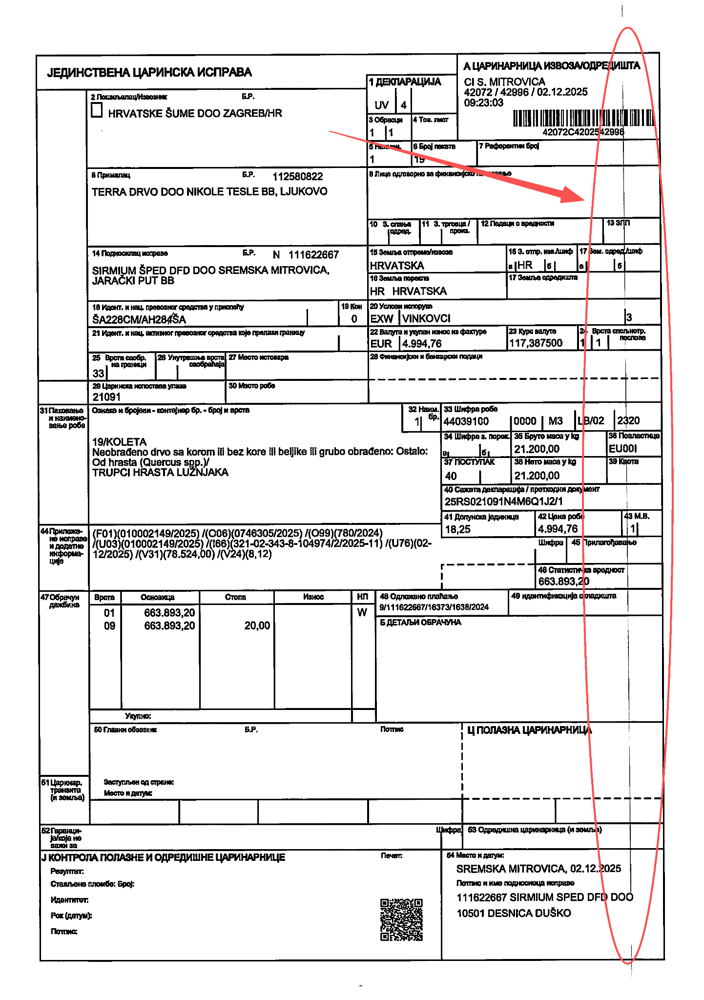
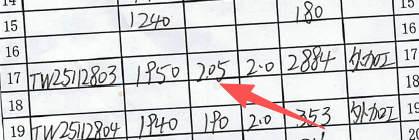
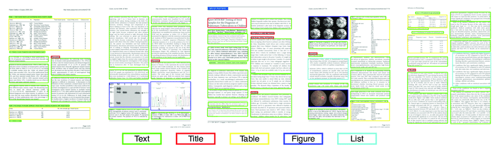

# **基于多模态文档理解的报关单自动识别与智能归档系统**

# **引言**

大量企业在处理进口报关单时仍依赖人工转录，将扫描件中的关键信息抄录到 Excel，用于统计、核算与财务管理。该流程重复、耗时且易错。在与家人所在企业的财务业务交流中，我们确认该流程高度可自动化。因此，本项目拟构建一个基于文档视觉与多模态 AI 的报关单自动识别与智能归档系统，目标是从合并扫描的多张报关单中自动定位单据、理解手写与印刷内容、抽取关键字段并生成结构化数据，显著降低人工录入成本，提升准确性与处理效率。

# **背景与问题陈述**

在与家人的沟通中得知，现实业务中，报关单常由货代汇总后一次性批量扫描或拍摄，形成一张或若干张包含多张单据的图像/PDF。单据中既有印刷体，也有大量手写内容，并伴随涂改、连笔、残墨、点状/条状噪声、模糊、倾斜等问题。当前财务人员需要逐项抄录进 Excel，为保证准确性还执行“人工录入—人工复核”双流程，工作量随单据量呈线性甚至倍增增长，且仍存在数字误读、字段遗漏、币种混淆等错误风险。

在此背景下，企业需要的不是仅仅能文字识别的扫描工具，而是一个端到端的文档 AI 管线：能从合并扫描中自动分割出每张报关单，对手写/涂改/噪声保持鲁棒性，进而抽取字段并结构化输出，最终支撑 Excel/报表及后续分析。

# **技术调研与现状综述**

1. ## **传统 OCR 的能力与局限**

   传统 OCR（如 Tesseract、PaddleOCR 的印刷体模型、通用云 OCR）在清晰印刷体场景表现稳定，但在本项目的真实数据中面临天然瓶颈：  
* **无法处理合并扫描的多单据定位/切割**：OCR只负责“认字”，不负责“从一张大图里找到多张报关单”。  
* **对手写/连笔/涂改鲁棒性差**：HTR（手写识别）与印刷 OCR 是不同问题域。  
* **字形相近的字体：**部分手写者的书写习惯中常出现下列易混淆字符：“2”与“z”、“9”与“q”、“I（大写i）”与“l（小写L）”与“1（数字1）”，极其依赖上下文判断。*图 1 展示了易被混淆为字母“p”的数字“9”*

图 1 易混淆的文字

* **对噪声笔画缺乏语义判断**：将非文字的笔画/污点误判为字符或标点。

**典型脏文档失败用例：**

* **干笔划线**：书写者为“出墨”在空白处反复划线，传统 OCR 常误识别为连续字符：`11111`、`/////`、`———`、`一一一`。  
  * **漏油/渗墨、点状/线状噪声**：稀疏斑点被误识别为标点或竖线：`.`、`'`、`;`、`|` 等。*图 2 展示了由于扫描问题在档案右侧产生一条长竖线的示例*

  图 2 线状噪声

  * **易混淆的点**：部分手写者习惯在字段附近随手点一点，或字体被遮挡后看起来像点，可能被混入金额/数字字段，造成小数点/句号误读（造成的错误通常是灾难性的）。*图 3 展示了由于表格遮挡，数字间看起来有小数点的示例（本应为“205”，此处看起来却像是“2.05”）*

  * **方向不正的扫描文件**：扫描文件可能歪斜，部分场景下对文字识别不利。*图 3 同时展示了方向不正的扫描文件*

  图 3 易混淆的点、方向不正的扫描文件

  * **涂改：**对错误的文字进行涂改，在一些情况下可能看起来反而像另一个文字（如对“0”划线可能变成“8”）

  **结论**：在“合并扫描 \+ 手写 \+ 脏文档”条件下，单纯传统 OCR 并不构成可用方案，无法满足业务所需的可靠性。

2. ## **文档实例检测与布局识别**

为从合并扫描中切出每张报关单，需要版面/实例检测与表格/区域结构化技术：

* **实例检测/分割**：[YOLO](https://docs.ultralytics.com/tasks/segment/) 模型能检测每张报关单的边界框，将单据裁剪出来；  
* **文档布局识别**：[LayoutParser](https://layout-parser.github.io/) 可以识别表格线、单元格位置、字段位置、内容区域。*见图 4*

图 4 文档布局识别

3. ## **手写文本识别（HTR）与语义校验**

* **HTR 模型**：面向手写体的 [PaddleOCR](https://github.com/PaddlePaddle/PaddleOCR) 模型，能处理连笔、风格差异。  
* **多模态大模型（VLM）**（如具备视觉理解能力的通用模型 [GPT5.1](https://platform.openai.com/docs/models/gpt-5.1)）能在复杂/脏文档中结合上下文进行语义校验（例如将“干笔划线”判断为噪声而非有效字符）。

4. ## **关键字段抽取（KIE）与表格映射**

*  [LayoutLMv3](https://huggingface.co/microsoft/layoutlmv3-base) 可以结合文本与空间位置进行 KIE， 将表格结构恢复与单元格关联，映射到固定 schema。

# **拟采用的解决方案**

## **总体思路**

构建一条“**多单据实例分割 → 手写/印刷混合识别 → 字段抽取 → 结构化校验 → 导出**”的管线。

## **处理流程**

1. **批量输入与预处理**  
   * 支持上传合并扫描图像/PDF；  
   * 倾斜/畸变校正、去噪、对比度增强；  
   * 粗分割文档区域，剔除空白边缘。  
2. **单据检测与实例分割**  
   * 采用 YOLO 检测每张报关单边界，从大图中裁切出多张单据。  
3. **文本/内容识别**  
   * **路径选择器（Router）**：对裁切出的区域进行印刷/手写/混合的路由判定；  
   * **HTR 分支**：使用 PaddleOCR 处理手写字段；  
   * **印刷体分支**：使用传统 OCR 处理印刷文字；  
4. **关键字段抽取（KIE）与语义校验**  
   * 使用 LayoutLMv3 直接产出 JSON；  
   * **语义与约束校验：**  
     * 金额/数量/币种/日期的类型与范围检查；  
     * 币种白名单（CNY/USD/EUR…）、日期规范化；  
     * 小数点/标点异常的上下文判别与修正。  
   * **噪声抑制**：使用 VLM 对“干笔划线/点状噪声/涂改”等噪声进行检测与排除。  
5. **结构化输出与回填**  
   * 映射 Excel；  
   * 生成“一张合并扫描对应多条 Excel 记录”的输出；  
   * 保存局部截图与字段对齐证据，便于人工复核。  
6. **人机协作**  
   * 复核界面展示字段值 \+ 对应图像区域；  
   * 主动学习：一键纠错并反向喂入少量样本用于持续改进。

# **预期成果**

* 能够从包含多张报关单的合并扫描图像中，自动检测并切分出每一张单据；  
* 对核心字段的抽取准确率达到 80% 左右；  
* 将人工录入时间减少至少 60%；  
* 在包含干笔划线、漏油点、方向不正、涂改等脏文档场景下，系统仍能保持可用的识别与校验能力；  
* 支持将识别结果导出为标准化 Excel，为后续财务分析提供结构化数据。

# **最小可行产品（MVP）**

* **输入**：一张包含 **5–20 张**报关单的合并扫描图像/PDF；  
* **输出**：对每张报关单产出一条结构化记录（Excel/CSV/JSON）；  
* **满足“预期成果”中的要求**

# **使用技术**

* **后端与业务编排**：Java \+ Spring Boot  
* **文档检测与实例分割**：Python \+ PyTorch，使用 [YOLO](https://docs.ultralytics.com/tasks/segment/) 模型  
* **手写识别（HTR）**：基于 [PaddleOCR](https://github.com/PaddlePaddle/PaddleOCR) 模型  
* **关键字段抽取与规则校验**：[LayoutLMv3](https://huggingface.co/microsoft/layoutlmv3-base) 等布局感知模型，配合正则表达式与业务规则  
* **数据存储与导出**：Excel，JSON 输出  
* **前端复核界面**：基于 Web 的复核与纠错工具
